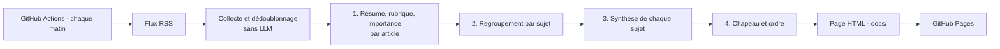

# Revue de presse quotidienne par LLM

Projet : agrège des flux RSS d'actualité et produit chaque matin une revue de presse
synthétique, publiée sur une page web (GitHub Pages). Tout tourne sur GitHub : aucun serveur à maintenir.

## Principe



Les étapes 1 à 4 utilisent le modèle ; chacune a **son propre fichier de consignes** dans `prompts/`.

Documentation de conception : `design/architecture.md` (options comparées), `design/decisions.md`
(journal des décisions), `design/carnet-de-bord.md` (gabarit éditorial pour le responsable éditorial). Instructions pour
Claude Code : `CLAUDE.md`.

## Qui modifie quoi

| Dossier / fichier | Rôle | Qui |
|---|---|---|
| `prompts/*.md` | Consignes éditoriales de chaque étape (ton, longueur, critères d'importance, règles de sourcing) | Responsable éditorial |
| `config/feeds.yaml` | Liste des flux RSS | Responsable éditorial |
| `config/settings.yaml` | Modèles, rubriques, plafonds, nombre de sujets | Responsable éditorial / technique |
| `src/`, `templates/`, `.github/` | Code, mise en page, planification | Responsable technique |

Le **format de sortie** (JSON) de chaque étape est imposé par le code (`src/pipeline.py`) et ajouté
automatiquement aux consignes : le responsable éditorial n'a donc pas à le décrire et ne peut pas le casser par erreur.
Les commentaires `<!-- ... -->` des fichiers de prompts ne sont pas envoyés au modèle.

## Mise en route (une seule fois)

1. Créer un dépôt GitHub et y déposer le contenu de ce dossier.
2. Dépôt → *Settings → Secrets and variables → Actions → onglet Variables* → ajouter les quatre variables de dépôt
   `ANTHROPIC_FEDERATION_RULE_ID`, `ANTHROPIC_ORGANIZATION_ID`, `ANTHROPIC_SERVICE_ACCOUNT_ID` et `ANTHROPIC_WORKSPACE_ID`
   (identifiants de la règle de fédération d'identité Claude ↔ GitHub Actions, voir `design/decisions.md` D9).
   **Pas de secret `ANTHROPIC_API_KEY`** : les workflows s'authentifient avec le jeton OIDC de GitHub, et une clé API
   définie par ailleurs aurait priorité sur la fédération.
3. *Settings → Pages* → Source : *GitHub Actions* (les workflows publient le dossier `docs/` via `actions/deploy-pages` ; un push du bot ne déclenche pas la construction « depuis une branche »).
4. *Settings → Actions → General → Workflow permissions* → *Read and write permissions*.
5. Vérifier les flux : `python -m src.main check-feeds` (en local) et corriger `config/feeds.yaml`.
6. Onglet *Actions* → « Revue de presse quotidienne » → *Run workflow* pour une première revue.

Ensuite la revue est générée automatiquement chaque jour vers 7 h (heure de Bruxelles en été, 6 h en hiver).

## Boucle de travail éditoriale (sans rien installer)

1. Modifier un fichier de `prompts/` directement sur GitHub (bouton crayon) et enregistrer (*commit*).
2. Onglet *Actions* → « Essai de prompts » → *Run workflow*. Renseigner un nom d'essai (ex. `v2-plus-sobre`)
   et l'étape à partir de laquelle rejouer :
   - modification de l'étape 4 (chapeau) → rejouer à partir de **4** (très peu coûteux) ;
   - modification de l'étape 3 (rédaction) → à partir de **3** ;
   - modification de l'étape 2 (regroupement) → à partir de **2** ;
   - modification de l'étape 1 (résumés, importance) → à partir de **1**.
3. L'essai est rejoué **sur les mêmes articles** que la revue de référence (`main`) : la différence observée vient
   du prompt, pas de l'actualité du jour. Une page de comparaison côte à côte est produite dans `docs/tests/`
   (adresse : `https://<utilisateur>.github.io/<dépôt>/tests/<date>-comparaison-main-vs-<essai>.html`).
4. Noter dans un carnet de bord, pour chaque version : ce qui a été changé, pourquoi, et ce qui a été observé
   (exactitude, couverture, redondance, lisibilité).

Chaque essai archive les prompts utilisés, les sorties de chaque étape (`data/runs/<date>/<essai>/stage*.json`)
et la revue finale, ce qui permet de justifier chaque choix éditorial.

## Utilisation en local (optionnel)

```bash
python -m venv .venv && source .venv/bin/activate
pip install -r requirements.txt
export ANTHROPIC_API_KEY=...            # local uniquement (GitHub Actions utilise la fédération) ; ou via 1Password CLI : op run -- python -m src.main ...

python -m src.main check-feeds                          # tester les flux
python -m src.main run --limit 30 --no-publish          # essai économique, rien n'est publié
python -m src.main replay --tag v2 --from-stage 3       # rejouer à partir de l'étape 3
python -m src.main compare --a main --b v2              # comparaison côte à côte
pytest                                                  # tests (aucun appel API)
```

## Garde-fous intégrés

- **Aucune URL inventée** : le modèle cite des identifiants d'articles ; les liens sont ajoutés par le programme.
  Un identifiant inconnu est ignoré et signalé dans les avertissements.
- **Dégradation maîtrisée** : si une étape échoue ou renvoie un JSON invalide (une relance est tentée),
  le programme se replie (résumé issu de l'extrait, ordre par score…) et le signale dans les avertissements
  affichés au bas de la page et enregistrés dans `digest.json`.
- **Doublons** : les titres quasi identiques sont fusionnés avant le modèle, et les sources fusionnées restent citées.
- **Transparence** : mention explicite sur chaque page que la revue est générée par un modèle et peut comporter des erreurs.

## Limites et points d'attention

- **Contenu des flux** : beaucoup de flux ne fournissent qu'un titre et un chapeau tronqué. Le projet travaille
  volontairement sur ces seuls éléments (pas de récupération du texte intégral : paywalls, droit d'auteur).
  La qualité des résumés dépend donc de la richesse des flux choisis.
- **Publication** : GitHub Pages est public. La page publie des synthèses courtes avec liens vers les sources
  (balise `noindex` pour éviter l'indexation) ; il convient de rester dans ce cadre et de ne pas republier de textes d'articles.
- **Regroupement par le LLM** : l'étape 2 regroupe les articles par similarité de sens via le modèle, sans base d'embeddings.
  C'est plus simple et entièrement pilotable par prompt ; si le nombre d'articles devient très grand, on pourra
  ajouter un pré-regroupement par embeddings.
- **Coûts** : ordre de grandeur de quelques centimes à quelques dizaines de centimes par jour pour ~200 articles
  (consulter les compteurs de tokens affichés à la fin de chaque exécution et la grille tarifaire en vigueur).
- **Identifiants de modèles** : à vérifier dans `config/settings.yaml` (ils évoluent) avant la première exécution.
- **Planification GitHub** : un dépôt public sans activité pendant 60 jours voit ses workflows planifiés désactivés.
  Les commits quotidiens du bot devraient suffire, mais cela mérite d'être surveillé.
