# Améliorations Architecturales - News-Aggregator

*Document de conception — Octobre 2026*  
*Statut : Proposition*  
*Version : 1.0*

---

## 📋 Table des matières

1. [Contexte et objectifs](#-contexte-et-objectifs)
2. [Architecture actuelle](#-architecture-actuelle)
3. [Analyse SWOT](#-analyse-swot)
4. [Points d'amélioration prioritaires](#-points-damélioration-prioritaires)
5. [Architectures alternatives](#-architectures-alternatives)
6. [Roadmap recommandée](#-roadmap-recommandée)
7. [Annexes](#-annexes)

---

## 🎯 Contexte et objectifs

### Contexte

Le projet **News-Aggregator** est une application Python qui :
- Agrège des flux RSS d'actualité
- Produit une revue de presse quotidienne synthétique
- Publie une page HTML statique via GitHub Pages
- Utilise des LLM (Claude) pour le traitement sémantique

L'architecture actuelle suit le modèle **Pipeline en étapes** (option 2 du document `design/architecture.md`) avec 4 étapes LLM séquentielles.

### Objectifs de ce document

- **Documenter** l'architecture actuelle de manière visuelle
- **Identifier** les forces, faiblesses, opportunités et menaces
- **Proposer** des améliorations concrètes et priorisées
- **Évaluer** des architectures alternatives
- **Établir** une roadmap d'implémentation

### Public cible

- Responsable technique (implémentation)
- Responsable éditorial (compréhension des impacts)
- Équipe de maintenance (décisions d'évolution)

---

## 🏗️ Architecture actuelle

### Diagramme global

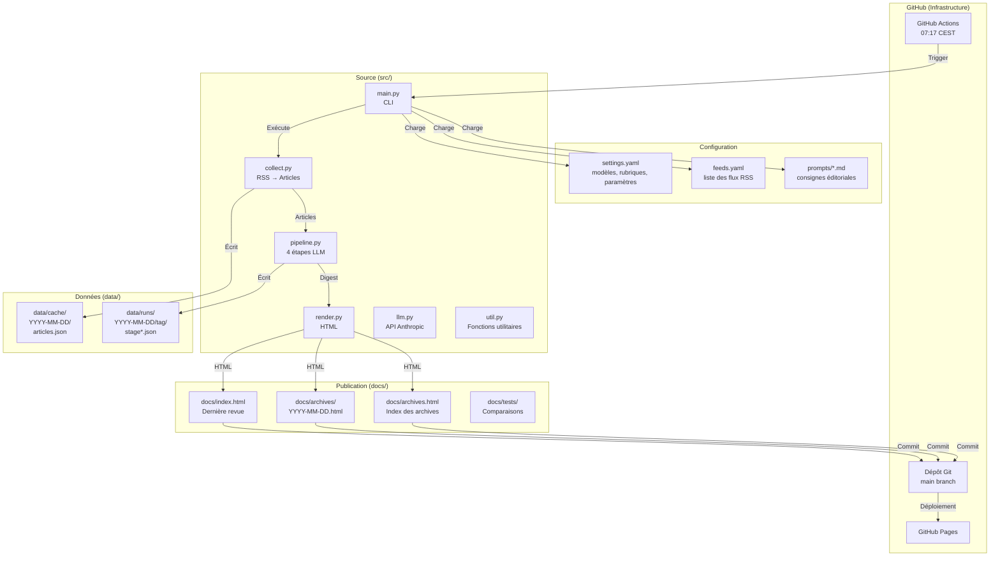

### Pipeline LLM détaillé

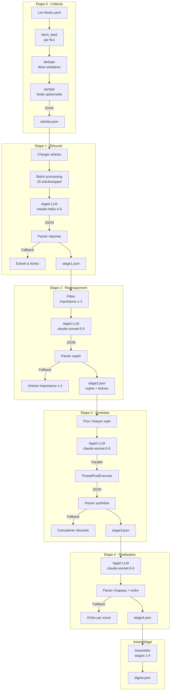

### Publication statique

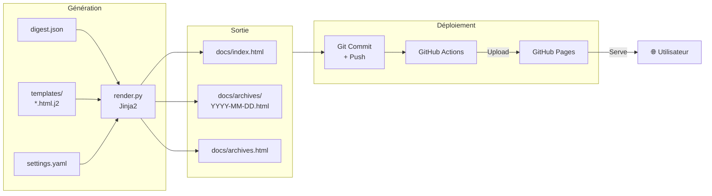

### Workflow GitHub Actions

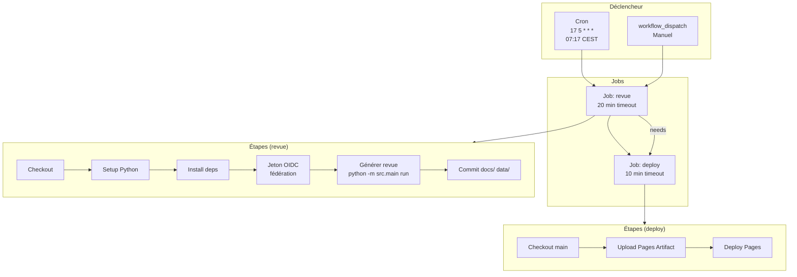

---

## 📊 Analyse SWOT

### Forces (Strengths)

| Catégorie | Description | Impact |
|-----------|-------------|--------|
| **Qualité** | Pipeline en 4 étapes spécialisées avec modèles adaptés | Meilleure qualité qu'un prompt unique |
| **Robustesse** | Mécanismes de repli (fallback) à chaque étape LLM | Dégradation maîtrisée, pas de plantage total |
| **Séparation des préoccupations** | Code technique vs prompts éditoriaux | Collaboration claire entre rôles |
| **Zéro infrastructure** | GitHub Actions + GitHub Pages | Aucun serveur à maintenir |
| **Transparence** | Archives complètes dans `data/runs/` | Reproductibilité, audit possible |
| **Évolutivité** | Batch processing + ThreadPoolExecutor | Gère ~200 articles/jour |
| **Sécurité** | Fédération d'identité OIDC avec GitHub | Pas de clés API en dur dans le code |
| **Optimisation économique** | Modèles adaptés par étape (haiku → sonnet) | Coût maîtrisé (quelques centimes/jour) |
| **Publication simple** | HTML statique + `.nojekyll` | Compatible GitHub Pages sans configuration complexe |

### Faiblesses (Weaknesses)

| Catégorie | Problème | Localisation | Impact | Priorité |
|-----------|----------|--------------|--------|----------|
| **Résilience** | Pas de retry exponentiel sur les appels API | `src/llm.py` | Échecs temporaires font planter le pipeline | ⭐⭐⭐⭐⭐ |
| **Résilience** | Pas de timeout sur ThreadPoolExecutor | `src/pipeline.py` | Un appel LLM bloqué bloque tout | ⭐⭐⭐⭐⭐ |
| **Résilience** | Pas de notification d'échec | `.github/workflows/` | Pas de visibilité sur les problèmes | ⭐⭐⭐⭐ |
| **Validation** | Pas de validation de schéma JSON | `src/pipeline.py` | Format de sortie non vérifié systématiquement | ⭐⭐⭐⭐ |
| **Reproductibilité** | Cache non versionné | `data/cache/` | Impossible de reproduire un ancien état | ⭐⭐⭐ |
| **Performance** | Regroupement par LLM uniquement | Étape 2 | Coûteux pour beaucoup d'articles | ⭐⭐⭐ |
| **Fonctionnalité** | Pas de flux RSS pour les archives | `src/render.py` | Pas de syndication du contenu | ⭐⭐ |
| **SEO** | Pas de sitemap.xml | `src/render.py` | Indexation limitée par les moteurs | ⭐⭐ |
| **Fiabilité** | Workflow ne vérifie pas les flux avant exécution | `revue-quotidienne.yml` | Risque de ne rien publier | ⭐⭐ |
| **Expérience utilisateur** | Design basique | `templates/base.html.j2` | Expérience utilisateur limitée | ⭐ |

### Opportunités (Opportunities)

| Opportunité | Description | Bénéfice potentiel |
|-------------|-------------|-------------------|
| **Embeddings** | Pré-regroupement par similarité cosine | Réduction des coûts LLM (moins d'appels) |
| **RSS Output** | Générer un flux RSS des archives | Syndication du contenu, abonnements |
| **Sitemap** | Générer sitemap.xml | Meilleure indexation SEO |
| **Design moderne** | Utiliser Pico CSS ou Tailwind | Meilleure expérience utilisateur |
| **Cache versionné** | Versionner le cache par configuration | Reproductibilité historique |
| **Validation stricte** | Utiliser Pydantic pour valider les sorties LLM | Meilleure robustesse, détection précoce |
| **Pages par sujet** | Générer une page par sujet | Meilleure navigation, partage facile |
| **Suivi historique** | Base vectorielle pour historique | Suivi des sujets dans le temps |
| **Notifications** | Intégrer Slack/Email notifications | Visibilité immédiate sur les échecs |

### Menaces (Threats)

| Menace | Description | Impact | Atténuation |
|--------|-------------|--------|-------------|
| **Dépendance feedparser** | Package non maintenu | Bloquant | Surveiller, prévoir alternative |
| **Limites GitHub Actions** | Timeout de 6h/job | Risque de timeout | Optimiser le pipeline |
| **Coût LLM** | Tarifs variables | Budget imprévisible | Surveiller l'usage |
| **Flux RSS instables** | Certains flux peuvent disparaître | Perte de sources | Multiplier les sources |
| **GitHub Pages limitations** | Pas de server-side logic | Fonctionnalités limitées | Utiliser fonctions serverless si besoin |
| **Gratuité GitHub** | Limite de 2000 minutes/mois | Risque de dépassement | Optimiser, surveiller |

---

## 🚀 Points d'amélioration prioritaires

### 🔴 Niveau 1 : Critique (À implémenter immédiatement)

#### 1.1 Gestion d'erreur robuste avec retry exponentiel

**Problème** : Un échec réseau ou API temporaire fait échouer tout le pipeline.  
**Localisation** : `src/llm.py`  
**Impact** : Perte complète de la revue du jour  
**Solution** : Implémenter retry avec backoff exponentiel

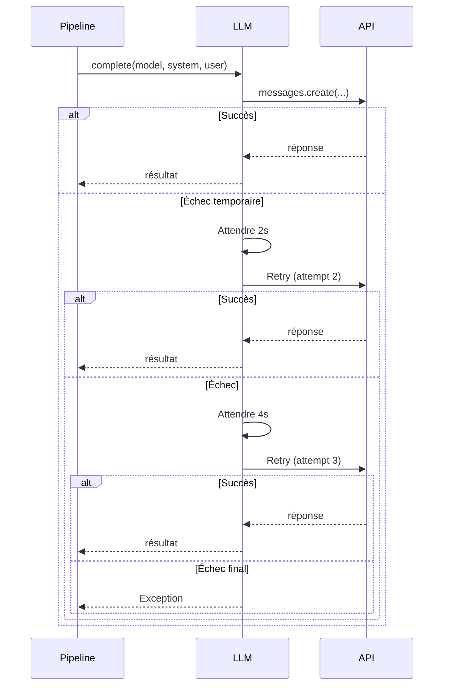

**Implémentation** :
```python
# src/llm.py
from tenacity import retry, stop_after_attempt, wait_exponential, retry_if_exception_type

@retry(
    stop=stop_after_attempt(3),
    wait=wait_exponential(multiplier=1, min=2, max=10),
    retry=retry_if_exception_type((ConnectionError, TimeoutError, ValueError))
)
def complete_with_retry(self, model: str, system: str, user: str, max_tokens: int) -> str:
    return self.complete(model, system, user, max_tokens)
```

**Effort** : Faible (1-2h)  
**Impact** : Très élevé (évite les échecs temporaires)  
**Priorité** : ⭐⭐⭐⭐⭐

---

#### 1.2 Timeout sur ThreadPoolExecutor

**Problème** : Un appel LLM bloqué bloque tous les autres workers.  
**Localisation** : `src/pipeline.py` (stages 1 et 3)  
**Impact** : Pipeline bloqué indéfiniment  
**Solution** : Ajouter timeout sur chaque future

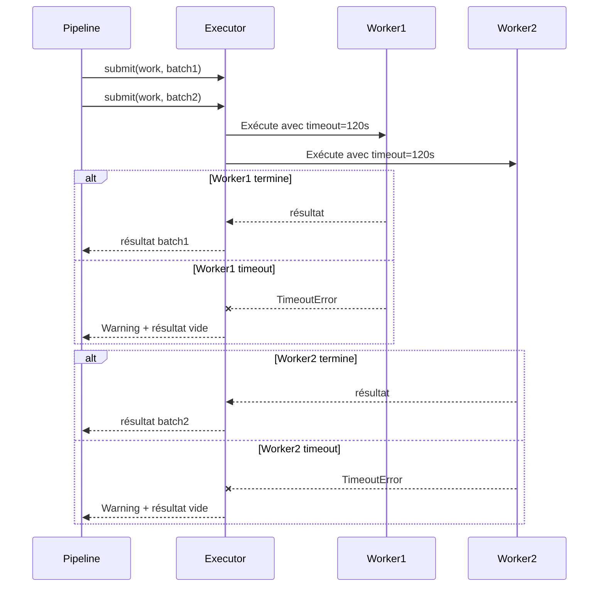

**Implémentation** :
```python
# src/pipeline.py
from concurrent.futures import as_completed, TimeoutError as FutureTimeoutError

# Dans stage1:
batches = [articles[i:i + size] for i in range(0, len(articles), size)]

with ThreadPoolExecutor(self.workers) as ex:
    futures = {ex.submit(work, batch): batch for batch in batches}
    
    for future in as_completed(futures, timeout=120):
        batch = futures[future]
        try:
            result = future.result()
            merged.update(result)
        except FutureTimeoutError:
            self.warn(f"Timeout sur batch de {len(batch)} articles")
        except Exception as exc:
            self.warn(f"Échec sur batch de {len(batch)} articles: {exc}")
```

**Effort** : Faible (2-3h)  
**Impact** : Très élevé (évite les blocages)  
**Priorité** : ⭐⭐⭐⭐⭐

---

#### 1.3 Notifications d'échec

**Problème** : Pas de visibilité quand la revue échoue.  
**Localisation** : `.github/workflows/revue-quotidienne.yml`  
**Impact** : Découverte tardive des problèmes  
**Solution** : Intégrer notifications Slack/Email

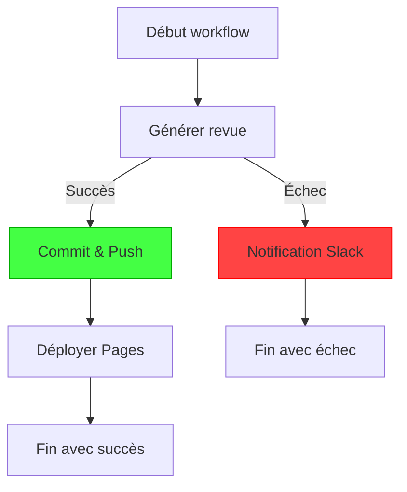

**Implémentation** (GitHub Actions) :
```yaml
# .github/workflows/revue-quotidienne.yml
- name: Générer la revue
  id: generate
  run: python -m src.main run || echo "FAILED=true" >> $GITHUB_OUTPUT

- name: Notification Slack (Échec)
  if: steps.generate.outputs.FAILED == 'true'
  uses: rtCamp/action-slack-notify@v2
  env:
    SLACK_WEBHOOK: ${{ secrets.SLACK_WEBHOOK }}
    SLACK_COLOR: danger
    SLACK_TITLE: "❌ Échec revue de presse"
    SLACK_MESSAGE: "La génération a échoué. Voir: ${{ github.server_url }}/${{ github.repository }}/actions/runs/${{ github.run_id }}"

- name: Notification Slack (Succès)
  if: steps.generate.outputs.FAILED != 'true'
  uses: rtCamp/action-slack-notify@v2
  env:
    SLACK_WEBHOOK: ${{ secrets.SLACK_WEBHOOK }}
    SLACK_COLOR: good
    SLACK_TITLE: "✅ Revue de presse générée"
    SLACK_MESSAGE: "Nouvelle revue disponible: https://${{ github.repository_owner }}.github.io/${{ github.event.repository.name }}"
```

**Effort** : Faible (1h)  
**Impact** : Très élevé (visibilité immédiate)  
**Priorité** : ⭐⭐⭐⭐⭐

---

### 🟡 Niveau 2 : Important (À implémenter sous 1-2 semaines)

#### 2.1 Validation de schéma JSON avec Pydantic

**Problème** : Le format JSON n'est pas systématiquement validé, risque d'erreurs silencieuses.  
**Localisation** : `src/pipeline.py`  
**Impact** : Données corrompues possibles  
**Solution** : Utiliser Pydantic pour valider les sorties LLM

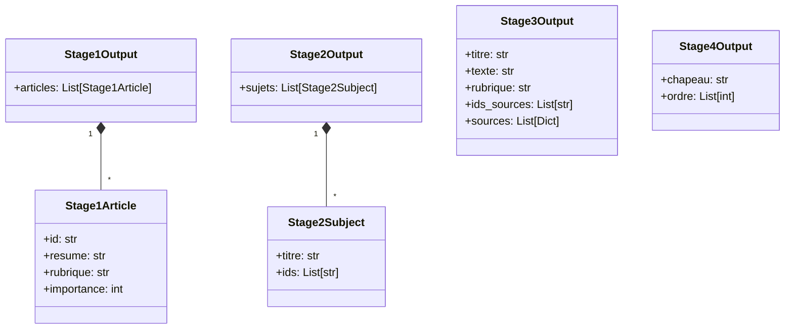

**Implémentation** :
```python
# src/models.py (nouveau)
from pydantic import BaseModel, validator
from typing import List, Optional

class Stage1Article(BaseModel):
    id: str
    resume: str
    rubrique: str
    importance: int
    
    @validator('rubrique')
    def rubrique_valide(cls, v, values, **kwargs):
        from .pipeline import Pipeline
        if hasattr(Pipeline, 'rubriques'):
            if v not in Pipeline.rubriques:
                return "Autres"
        return v
    
    @validator('importance')
    def importance_valide(cls, v):
        return max(1, min(5, v))

class Stage1Output(BaseModel):
    articles: List[Stage1Article]

# Puis dans pipeline.py:
def _call(self, stage: int, data):
    raw = call_json(self.llm, ...)
    if stage == 1:
        return Stage1Output(**raw).dict()
    # etc.
```

**Effort** : Moyen (2-4h)  
**Impact** : Élevé (meilleure robustesse)  
**Priorité** : ⭐⭐⭐⭐

---

#### 2.2 Cache versionné par configuration

**Problème** : Impossible de reproduire une revue historique avec une ancienne configuration.  
**Localisation** : `src/main.py`, `data/cache/`  
**Impact** : Non-reproductibilité des anciens runs  
**Solution** : Versionner le cache par hash de configuration

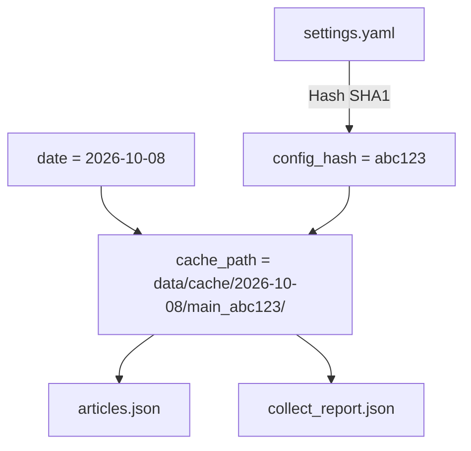

**Implémentation** :
```python
# src/main.py
def get_cache_path(settings: dict, day: date, tag: str = "main") -> Path:
    # Créer un hash des paramètres pertinents
    config_str = f"{settings['models']}{settings['collect']}{settings['llm']}{settings['digest']}"
    config_hash = hashlib.sha1(config_str.encode()).hexdigest()[:8]
    return DATA / "cache" / day.isoformat() / f"{tag}_{config_hash}"

def get_run_path(settings: dict, day: date, tag: str) -> Path:
    config_hash = hashlib.sha1(
        f"{settings['models']}{settings['prompts']}".encode()
    ).hexdigest()[:8]
    return DATA / "runs" / day.isoformat() / f"{tag}_{config_hash}"
```

**Effort** : Moyen (3-4h)  
**Impact** : Élevé (reproductibilité)  
**Priorité** : ⭐⭐⭐⭐

---

#### 2.3 Pré-regroupement par embeddings

**Problème** : L'étape 2 (regroupement) est coûteuse et devient lente avec beaucoup d'articles.  
**Localisation** : `src/pipeline.py` (stage2)  
**Impact** : Coût LLM élevé pour les grands volumes  
**Solution** : Pré-regrouper par similarité cosine avant l'appel LLM

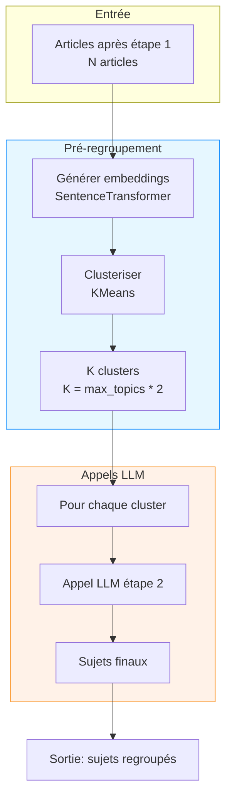

**Implémentation** :
```python
# src/pipeline.py
def stage2_optimized(self, articles: list[dict]) -> dict:
    cfg = self.s["digest"]
    pool = [a for a in articles if a["importance"] >= cfg["min_importance"]]
    
    if len(pool) > 50:  # Seuil pour activer le pré-regroupement
        return self._stage2_with_embeddings(pool)
    else:
        return self.stage2(pool)  # Méthode existante

def _stage2_with_embeddings(self, articles: list[dict]) -> dict:
    from sentence_transformers import SentenceTransformer
    from sklearn.cluster import KMeans
    import numpy as np
    
    # Charger modèle d'embeddings
    model = SentenceTransformer('paraphrase-multilingual-MiniLM-L12-v2')
    
    # Générer embeddings
    texts = [f"{a['titre']} {a['resume']}" for a in articles]
    embeddings = model.encode(texts)
    
    # Clusteriser
    n_clusters = min(len(articles), self.s["digest"]["max_topics"] * 2)
    if n_clusters > 1:
        kmeans = KMeans(n_clusters=n_clusters, random_state=42, n_init=10)
        clusters = kmeans.fit_predict(embeddings)
    else:
        clusters = [0] * len(articles)
    
    # Regrouper articles par cluster
    clusters_articles = {}
    for i, cluster in enumerate(clusters):
        clusters_articles.setdefault(cluster, []).append(articles[i])
    
    # Appeler LLM par cluster
    all_sujets = []
    for cluster_id, cluster_arts in clusters_articles.items():
        if not cluster_arts:
            continue
        
        # Préparer payload pour ce cluster
        payload = [{
            "id": a["id"], "source": a["source"], "titre": a["titre"],
            "resume": a["resume"], "rubrique": a["rubrique"],
            "importance": a["importance"]
        } for a in cluster_arts]
        
        try:
            data = self._call(2, payload)
            for s in data.get("sujets", []):
                all_sujets.append(s)
        except Exception as exc:
            self.warn(f"Étape 2 cluster {cluster_id}: {exc}")
            # Repli: ajouter chaque article comme sujet
            for a in cluster_arts:
                all_sujets.append({"titre": a["titre"], "ids": [a["id"]]})
    
    # Continuer avec le traitement normal
    return self._process_sujets(all_sujets, articles)
```

**Effort** : Moyen (4-6h + tests)  
**Impact** : Élevé (réduction des coûts LLM)  
**Priorité** : ⭐⭐⭐⭐

---

#### 2.4 Génération de flux RSS

**Problème** : Pas de syndication du contenu produit.  
**Localisation** : `src/render.py`  
**Impact** : Les utilisateurs ne peuvent pas s'abonner  
**Solution** : Générer un flux RSS des archives

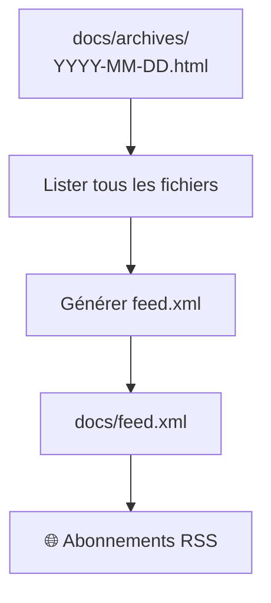

**Implémentation** :
```python
# src/render.py
def render_rss(days: list[str], settings: dict) -> str:
    from datetime import datetime
    from email.utils import formatdate
    
    site_url = settings.get('site', {}).get('url', f'https://github.com/{os.getenv("GITHUB_REPOSITORY", "user/repo")}')
    
    items_xml = ''
    for day in sorted(days, reverse=True):
        date_obj = date.fromisoformat(day)
        date_fr = fr_date(date_obj)
        pub_date = formatdate(datetime.combine(date_obj, datetime.min.time()).timestamp(), usegmt=True)
        
        items_xml += f'''  <item>
    <title>Revue du {date_fr}</title>
    <description>Revue de presse du {date_fr}</description>
    <link>{site_url}/archives/{day}.html</link>
    <pubDate>{pub_date}</pubDate>
    <guid>{site_url}/archives/{day}.html</guid>
  </item>
'''
    
    return f'''<?xml version="1.0" encoding="UTF-8"?>
<rss version="2.0" xmlns:atom="http://www.w3.org/2005/Atom">
  <channel>
    <title>{settings['site']['title']}</title>
    <description>{settings['site']['subtitle']}</description>
    <link>{site_url}</link>
    <language>fr-FR</language>
    <pubDate>{formatdate(datetime.utcnow().timestamp(), usegmt=True)}</pubDate>
    <lastBuildDate>{formatdate(datetime.utcnow().timestamp(), usegmt=True)}</lastBuildDate>
    <atom:link href="{site_url}/feed.xml" rel="self" type="application/rss+xml" />
{items_xml}  </channel>
</rss>'''

# Dans publish():
def publish(digest: dict, docs_dir: Path, settings: dict) -> list[Path]:
    # ... code existant ...
    
    # Générer RSS
    days = sorted((p.stem for p in (docs / "archives").glob("*.html")), reverse=True)
    if days:
        rss_path = docs / "feed.xml"
        rss_path.write_text(render_rss(days, settings), encoding="utf-8")
        written.append(rss_path)
    
    return written
```

**Effort** : Faible (2h)  
**Impact** : Moyen (syndication)  
**Priorité** : ⭐⭐⭐

---

### 🟢 Niveau 3 : Utile (À implémenter sous 1 mois)

#### 3.1 Génération de sitemap.xml

**Problème** : Indexation limitée par les moteurs de recherche.  
**Localisation** : `src/render.py`  
**Impact** : SEO limité  
**Solution** : Générer sitemap.xml

**Implémentation** :
```python
# src/render.py
def render_sitemap(pages: list[str], settings: dict) -> str:
    from datetime import datetime
    
    site_url = settings.get('site', {}).get('url', f'https://github.com/{os.getenv("GITHUB_REPOSITORY", "user/repo")}')
    today = datetime.utcnow().strftime('%Y-%m-%d')
    
    items_xml = ''
    for page in pages:
        if page == "index.html":
            url = site_url
            priority = "1.0"
            changefreq = "daily"
        elif page.startswith("archives/"):
            url = f"{site_url}/{page}"
            priority = "0.8"
            changefreq = "daily"
        elif page == "archives.html":
            url = f"{site_url}/{page}"
            priority = "0.7"
            changefreq = "daily"
        elif page == "feed.xml":
            url = f"{site_url}/{page}"
            priority = "0.5"
            changefreq = "hourly"
        else:
            continue
        
        items_xml += f'''  <url>
    <loc>{url}</loc>
    <lastmod>{today}</lastmod>
    <changefreq>{changefreq}</changefreq>
    <priority>{priority}</priority>
  </url>
'''
    
    return f'''<?xml version="1.0" encoding="UTF-8"?>
<urlset xmlns="http://www.sitemaps.org/schemas/sitemap/0.9">
{items_xml}</urlset>'''

# Dans publish():
pages = ["index.html"] + \
        [f"archives/{d}.html" for d in days] + \
        ["archives.html", "feed.xml"]

sitemap_path = docs / "sitemap.xml"
sitemap_path.write_text(render_sitemap(pages, settings), encoding="utf-8")
written.append(sitemap_path)
```

**Effort** : Faible (2h)  
**Impact** : Faible-Moyen (SEO)  
**Priorité** : ⭐⭐

---

#### 3.2 Design moderne avec Pico CSS

**Problème** : Design basique et peu professionnel.  
**Localisation** : `templates/base.html.j2`  
**Impact** : Expérience utilisateur limitée  
**Solution** : Intégrer Pico CSS (framework léger)

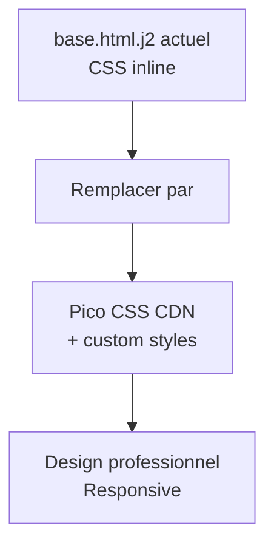

**Implémentation** :
```html
<!-- templates/base.html.j2 -->
<!doctype html>
<html lang="fr">
<head>
<meta charset="utf-8">
<meta name="viewport" content="width=device-width, initial-scale=1">
<meta name="robots" content="noindex, nofollow">
<title>{{ site.title }}</title>

<!-- Pico CSS -->
<link rel="stylesheet" href="https://cdn.jsdelivr.net/npm/@picocss/pico@2/css/pico.min.css">

<!-- Custom styles -->
<style>
  :root {
    --primary: #1f5fbf;
    --primary-hover: #1a4fb3;
  }
  
  body {
    max-width: 720px;
    margin: 0 auto;
    padding: 2rem 1rem;
    font: 17px/1.6 Georgia, "Times New Roman", serif;
  }
  
  header {
    margin-bottom: 2rem;
    border-bottom: 2px solid var(--primary);
    padding-bottom: 1rem;
  }
  
  h1 { margin: 0; }
  
  .chapeau {
    font-size: 1.12rem;
    border-left: 3px solid var(--primary);
    padding-left: 14px;
    margin: 28px 0;
  }
  
  .card {
    background: var(--card-bg, #fff);
    border: 1px solid var(--card-border, #e4e2dc);
    border-radius: 8px;
    padding: 1.2rem;
    margin: 1rem 0;
  }
  
  .rubrique {
    display: inline-block;
    padding: 0.25rem 0.75rem;
    border-radius: 9999px;
    background: var(--primary-light, #eef3fb);
    color: var(--primary);
    font-size: 0.75rem;
    font-weight: 600;
    text-transform: uppercase;
    letter-spacing: 0.05em;
  }
  
  .sources {
    font-size: 0.88rem;
    color: var(--muted);
    margin-top: 0.5rem;
  }
  
  .breves {
    margin-top: 2rem;
    padding-left: 1rem;
  }
  
  .breves li {
    margin: 0.5rem 0;
  }
  
  footer {
    margin-top: 2rem;
    padding-top: 1rem;
    border-top: 1px solid var(--card-border, #e4e2dc);
    font-size: 0.88rem;
    color: var(--muted);
  }
  
  @media (prefers-color-scheme: dark) {
    :root {
      --card-bg: #1f1f1d;
      --card-border: #33332f;
      --primary-light: #232b38;
    }
    
    body {
      background: #161615;
      color: #ecebe6;
    }
    
    a { color: #7fb0ff; }
    
    .card {
      background: var(--card-bg);
      border-color: var(--card-border);
    }
  }
</style>


</head>
<body>
<div class="container">

</div>
</body>
</html>
```

**Effort** : Faible (2-3h)  
**Impact** : Moyen (expérience utilisateur)  
**Priorité** : ⭐⭐

---

#### 3.3 Pages de détails par sujet

**Problème** : Pas de liens directs vers les sujets individuels.  
**Localisation** : `src/render.py`, `templates/`  
**Impact** : Navigation et partage limités  
**Solution** : Générer une page par sujet

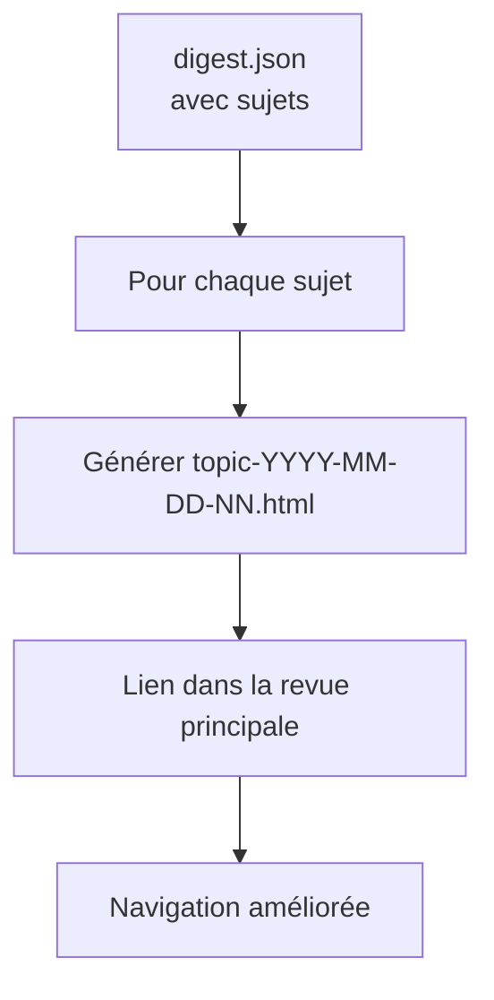

**Implémentation** :
```python
# src/render.py
def render_topic(topic: dict, digest_date: str, index: int, settings: dict) -> str:
    return _env().get_template("topic.html.j2").render(
        topic=topic,
        digest_date=digest_date,
        index=index,
        site=settings["site"],
        base="../"
    )

# templates/topic.html.j2

{{ topic.titre }} — {{ site.title }}

<header>
  <h1>{{ topic.titre }}</h1>
  <p><a href="{{ base }}index.html">← Retour à la revue</a></p>
  <p><strong>Date:</strong> {{ digest_date }}</p>
  <p><span class="rubrique">{{ topic.rubrique }}</span></p>
</header>

<article>
  {{ topic.texte }}
</article>

<section class="sources">
  <h3>Sources:</h3>
  <ul>
    
    <li><a href="{{ source.url }}" target="_blank">{{ source.source }}: {{ source.titre }}</a></li>
    
  </ul>
</section>

<footer>
  <p>Sujet {{ index + 1 }} de la revue du {{ digest_date }}.</p>
</footer>


# Dans publish():
for i, topic in enumerate(digest['topics']):
    topic_dir = docs / "topics"
    topic_dir.mkdir(parents=True, exist_ok=True)
    topic_path = topic_dir / f"{digest['date']}-{i:02d}.html"
    topic_path.write_text(
        render_topic(topic, digest['date'], i, settings),
        encoding="utf-8"
    )
    written.append(topic_path)
```

**Effort** : Moyen (3-4h)  
**Impact** : Moyen (navigation, SEO)  
**Priorité** : ⭐⭐

---

## 🏗️ Architectures alternatives

### Alternative 1 : Pipeline avec base vectorielle (Option 5)

**Concept** : Stocker les articles dans une base vectorielle pour pré-regroupement efficace et suivi historique.

```mermaid
flowchart TB
    subgraph GitHub["GitHub"]
        GA[GitHub Actions]
    end
    
    subgraph VectorDB["Base Vectorielle"]
        VDB[Qdrant/Weaviate\nEmbeddings]
    end
    
    subgraph Current["Actuel"]
        COLLECT[Collecte]
        PIPELINE[Pipeline LLM]
        RENDER[Rendu]
    end
    
    subgraph Enhanced["Amélioré"]
        COLLECT2[Collecte]
        VDBWRITE[Écrire dans VDB]
        PRECLUSTER[Pré-regroupement\npar embeddings]
        PIPELINE2[Pipeline LLM\n(étapes 2-4 optimisées)]
        RENDER2[Rendu]
    end
    
    GA --> COLLECT2
    COLLECT2 --> COLLECT
    COLLECT --> VDBWRITE
    VDBWRITE --> VDB
    
    COLLECT2 --> PRECLUSTER
    VDB --> PRECLUSTER
    PRECLUSTER --> PIPELINE2
    PIPELINE2 --> PIPELINE
    PIPELINE --> RENDER2
    RENDER2 --> RENDER
```

**Avantages** :
- ✅ Pré-regroupement ultra-rapide et précis
- ✅ Possibilité de suivre un sujet dans le temps
- ✅ Recherche sémantique avancée
- ✅ Évolutivité accrue (1000+ articles/jour)

**Inconvénients** :
- ❌ Complexité opérationnelle (base à héberger)
- ❌ Coût supplémentaire (Qdrant Cloud ~$10-30/mois)
- ❌ Latence réseau
- ❌ Maintenance accrue

**Quand l'envisager ?** :
- Volume d'articles > 500/jour
- Besoin de suivi historique des sujets
- Budget disponible pour l'infrastructure

**Implémentation recommandée** : Qdrant Cloud (gratuit jusqu'à 1GB) ou ChromaDB local.

---

### Alternative 2 : Agent autonome (Option 4)

**Concept** : Un agent LLM qui choisit lui-même quels flux lire et comment structurer la revue.

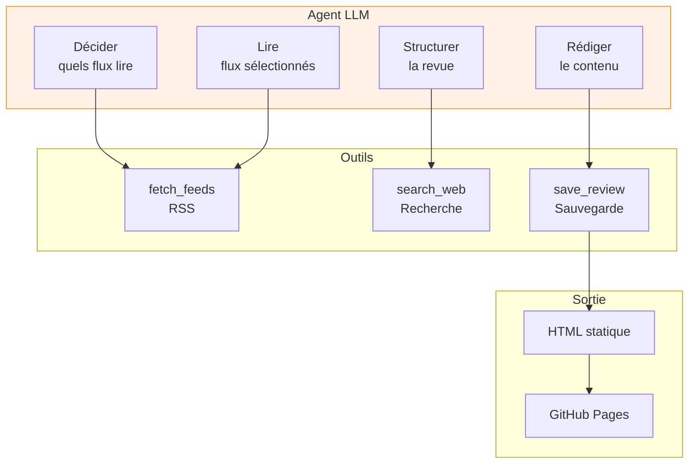

**Avantages** :
- ✅ Flexibilité maximale
- ✅ Peut adapter la revue à l'actualité
- ✅ Peut enrichir avec des recherches web
- ✅ Moins de code à maintenir

**Inconvénients** :
- ❌ Non déterministe (résultat variable)
- ❌ Plus cher (plus d'appels LLM)
- ❌ Difficile à déboguer
- ❌ Résultats imprévisibles
- ❌ Risque de hallucinations accru

**Quand l'envisager ?** :
- Acceptation du non-déterminisme
- Budget LLM important
- Besoin de flexibilité extrême
- **Non recommandé** pour une revue de presse quotidienne standard

---

### Alternative 3 : Orchestration avec n8n

**Concept** : Utiliser n8n (workflow visuel) pour orchestrer tout le pipeline.

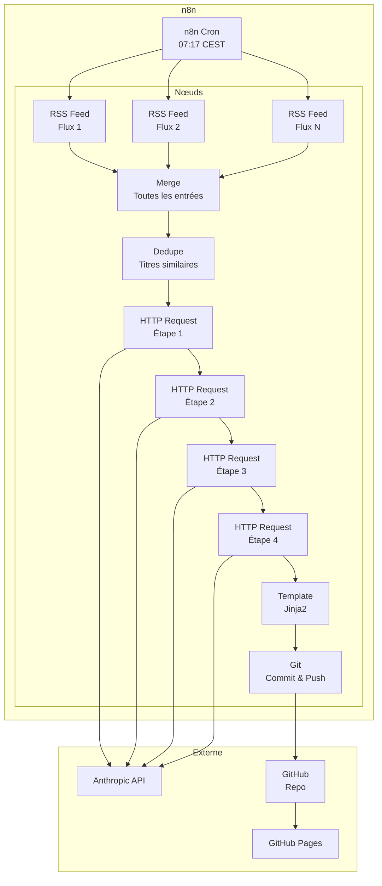

**Avantages** :
- ✅ Interface visuelle (accessible aux non-techniques)
- ✅ Planification intégrée
- ✅ Gestion des erreurs visuelle
- ✅ Historique des exécutions

**Inconvénients** :
- ❌ Auto-hébergement à maintenir (ou coût n8n cloud)
- ❌ Versionnage du code moins naturel
- ❌ Tests moins pratiques
- ❌ Workflows complexes deviennent illisibles

**Quand l'envisager ?** :
- Besoin d'accessibilité non-technique
- Voltige de workflows fréquents
- Budget pour n8n Cloud (~$20-50/mois)

---

### Alternative 4 : Publication via Netlify/Vercel

**Concept** : Remplacer GitHub Pages par Netlify ou Vercel pour plus de flexibilité.

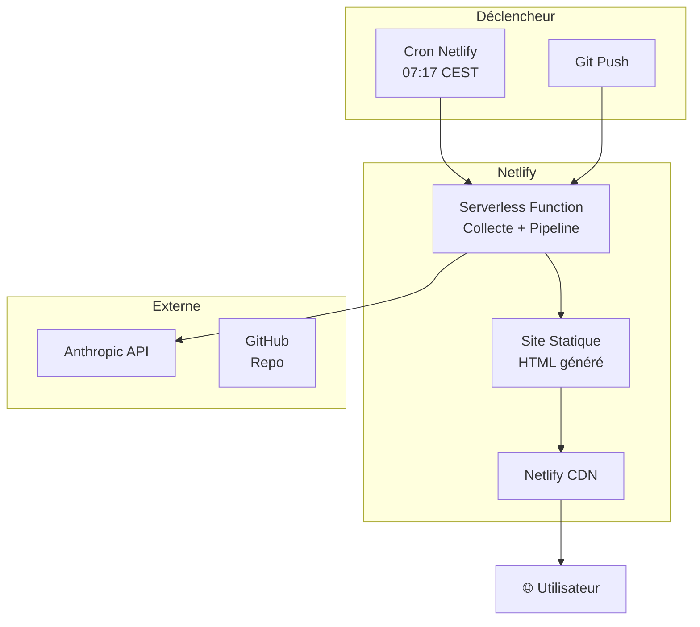

**Avantages** :
- ✅ Déploiement instantané
- ✅ Fonctions serverless intégrées
- ✅ Cache CDN performant
- ✅ Prévisualisation des PR
- ✅ Déploiement multi-régions

**Inconvénients** :
- ❌ Configuration plus complexe
- ❌ Limites des fonctions serverless (timeout 10min, mémoire)
- ❌ Coût potentiel à grande échelle

**Quand l'envisager ?** :
- Besoin de déploiement instantané
- Besoin de fonctions serverless
- Budget pour Netlify/Vercel Pro

---

### Alternative 5 : Application containerisée

**Concept** : Dockeriser l'application pour facilité de déploiement.

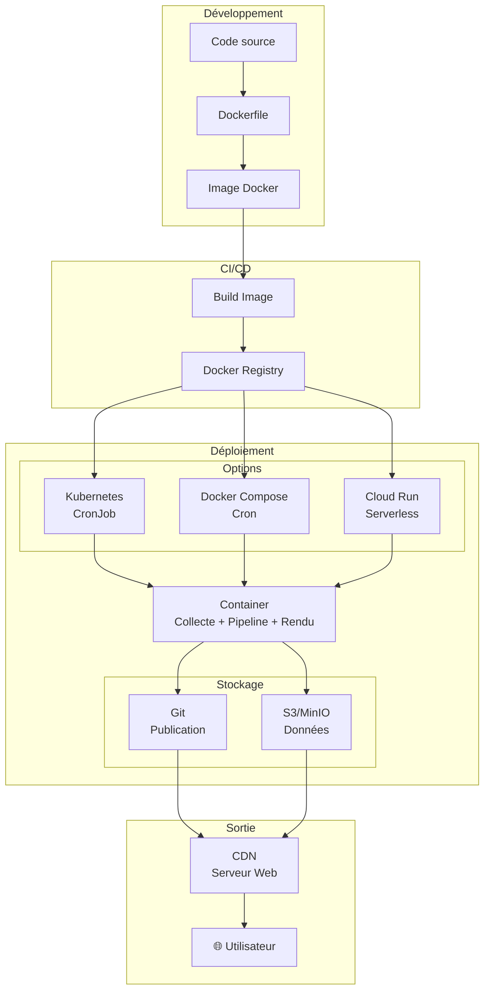

**Avantages** :
- ✅ Portabilité maximale
- ✅ Environnement reproductible
- ✅ Facilité de déploiement multi-environnement
- ✅ Intégration CI/CD flexible

**Inconvénients** :
- ❌ Complexité accrue
- ❌ Nécessite un registry Docker
- ❌ Surcoût infrastructure

**Quand l'envisager ?** :
- Déploiement multi-environnement (dev, staging, prod)
- Besoin de portabilité maximale
- Infrastructure Docker existante

---

## 🗺️ Roadmap recommandée

### Phase 1 : Stabilité (1-2 jours)

**Objectif** : Corriger les problèmes critiques de résilience

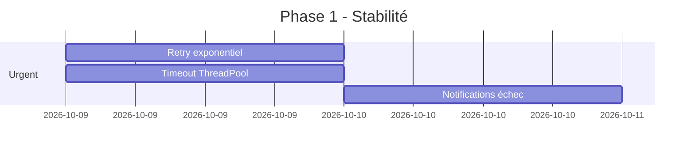

| Tâche | Priorité | Effort | Impact | Responsable |
|-------|----------|--------|--------|-------------|
| Implémenter retry exponentiel | ⭐⭐⭐⭐⭐ | 1-2h | ⭐⭐⭐⭐⭐ | Technique |
| Ajouter timeout sur ThreadPool | ⭐⭐⭐⭐⭐ | 2-3h | ⭐⭐⭐⭐⭐ | Technique |
| Configurer notifications Slack | ⭐⭐⭐⭐ | 1h | ⭐⭐⭐⭐ | Technique |

---

### Phase 2 : Robustesse (1 semaine)

**Objectif** : Améliorer la qualité et la reproductibilité

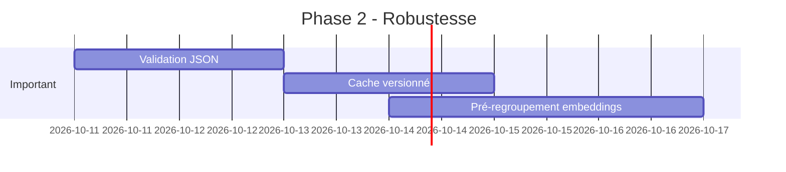

| Tâche | Priorité | Effort | Impact | Responsable |
|-------|----------|--------|--------|-------------|
| Validation schéma JSON avec Pydantic | ⭐⭐⭐⭐ | 2-4h | ⭐⭐⭐⭐ | Technique |
| Cache versionné par configuration | ⭐⭐⭐⭐ | 3-4h | ⭐⭐⭐⭐ | Technique |
| Pré-regroupement par embeddings | ⭐⭐⭐⭐ | 4-6h | ⭐⭐⭐⭐ | Technique |

---

### Phase 3 : Fonctionnalités (2 semaines)

**Objectif** : Ajouter des fonctionnalités utiles

```mermaid
gantt
    title Phase 3 - Fonctionnalités
    dateFormat  YYYY-MM-DD
    section Utile
    Génération RSS              :c1, 2026-10-17, 1d
    Sitemap.xml                 :c2, 2026-10-17, 1d
    Design Pico CSS             :c3, 2026-10-18, 2d
    Pages par sujet             :c4, 2026-10-20, 3d
```

| Tâche | Priorité | Effort | Impact | Responsable |
|-------|----------|--------|--------|-------------|
| Générer feed.xml (RSS) | ⭐⭐⭐ | 2h | ⭐⭐⭐ | Technique |
| Générer sitemap.xml | ⭐⭐ | 2h | ⭐⭐ | Technique |
| Migrer vers Pico CSS | ⭐⭐ | 2-3h | ⭐⭐ | Technique/Design |
| Pages de détails par sujet | ⭐⭐ | 3-4h | ⭐⭐ | Technique |

---

### Phase 4 : Optionnel (1 mois)

**Objectif** : Expérimenter des améliorations avancées

```mermaid
gantt
    title Phase 4 - Optionnel
    dateFormat  YYYY-MM-DD
    section Expérimental
    Base vectorielle (Qdrant)   :d1, 2026-11-01, 5d
    Vérification flux avant run :d2, 2026-11-03, 1d
    Tests automatiques         :d3, 2026-11-04, 2d
```

| Tâche | Priorité | Effort | Impact | Responsable |
|-------|----------|--------|--------|-------------|
| Intégrer Qdrant pour pré-regroupement | ⭐ | 5-8h | ⭐⭐⭐ | Technique |
| Vérifier les flux avant pipeline | ⭐⭐ | 1-2h | ⭐⭐ | Technique |
| Ajouter tests automatiques | ⭐⭐ | 2-3h | ⭐⭐ | Technique |

---

## 📊 Comparatif des architectures

| Critère | Actuel (GitHub Pages) | Netlify | Vercel | S3 + CloudFront | n8n | Agent Autonome | Base Vectorielle |
|---------|------------------------|---------|--------|-----------------|-----|----------------|------------------|
| **Coût** | Gratuit | Gratuit (limites) | Gratuit (limites) | ~$1-5/mois | ~$20-50/mois | $$$ | ~$10-30/mois |
| **Complexité** | Faible | Moyenne | Moyenne | Moyenne | Élevée | Très élevée | Élevée |
| **Maintenance** | Très faible | Faible | Faible | Moyenne | Élevée | Très élevée | Élevée |
| **Fiabilité** | Très haute | Haute | Haute | Très haute | Moyenne | Faible | Haute |
| **Évolutivité** | Moyenne | Élevée | Élevée | Très élevée | Moyenne | Moyenne | Très élevée |
| **Flexibilité** | Moyenne | Élevée | Élevée | Élevée | Très élevée | Très élevée | Moyenne |
| **Latence** | 1-5 min | <1 min | <1 min | <1 min | 5-10 min | Variable | 1-5 min |
| **Fonctionnalités avancées** | ❌ | ✅ (Serverless) | ✅ (Serverless) | ❌ | ✅ (Workflow) | ✅ (Recherche) | ✅ (Historique) |
| **Recommandation** | **⭐⭐⭐⭐⭐** | ⭐⭐⭐⭐ | ⭐⭐⭐⭐ | ⭐⭐⭐ | ⭐⭐ | ⭐ | ⭐⭐⭐ |

---

## 🎯 Recommandation finale

### ✅ **Conserver l'architecture actuelle**

L'architecture **Pipeline en étapes + GitHub Pages** est **la meilleure solution** pour ce projet car elle offre :

- ✅ **Qualité** : Meilleure qualité qu'un prompt unique grâce aux 4 étapes spécialisées
- ✅ **Robustesse** : Mécanismes de repli intégrés à chaque étape
- ✅ **Simplicité** : Zéro infrastructure à maintenir
- ✅ **Coût** : Optimisé (modèles adaptés par étape, coût de quelques centimes/jour)
- ✅ **Collaboration** : Séparation claire entre code technique et prompts éditoriaux
- ✅ **Transparence** : Archives complètes pour reproductibilité et audit

### 🚀 **Priorités d'amélioration**

1. **🔴 Critique** (1-2 jours) : Résilience (retry, timeout, notifications)
2. **🟡 Important** (1 semaine) : Robustesse (validation, cache versionné, embeddings)
3. **🟢 Utile** (2 semaines) : Fonctionnalités (RSS, sitemap, design, pages par sujet)
4. **🔵 Optionnel** (1 mois) : Expérimentations (base vectorielle)

### 📌 **Quand changer d'architecture ?**

| Situation | Alternative recommandée |
|-----------|------------------------|
| Volume > 500 articles/jour | Base vectorielle (Qdrant) |
| Besoin de déploiement instantané | Netlify/Vercel |
| Besoin d'accessibilité non-technique | n8n (si budget disponible) |
| Acceptation du non-déterminisme + budget LLM | Agent autonome (non recommandé) |

### 💡 **Verdict**

> **"If it ain't broke, don't fix it."**
> 
> L'architecture actuelle fonctionne **excellemment**. Les améliorations proposées sont **incrémentales** et visent à :
> - **Corriger** les faiblesses identifiées (résilience, validation)
> - **Optimiser** les performances (embeddings, cache)
> - **Enrichir** les fonctionnalités (RSS, sitemap, design)
> 
> **Ne pas changer de paradigme** sans raison impérieuse. Le ratio qualité/coût/maintenance de l'architecture actuelle est **optimal** pour une revue de presse statique quotidienne.

---

## 📚 Annexes

### A.1 - Diagramme de flux complet

```mermaid
flowchart TB
    %% Configuration
    subgraph Config["📁 Configuration"]
        CFG1[settings.yaml\n🔧 Paramètres]
        CFG2[feeds.yaml\n📡 Flux RSS]
        CFG3[prompts/*.md\n✍️ Consignes]
    end
    
    %% Collecte
    subgraph Collecte["🔄 Collecte"]
        C1[load_feeds\n↓]
        C2[fetch_feed\npar flux ↓]
        C3[dedupe\n🔍 Déduplication ↓]
        C4[sample\n✂️ Limite ↓]
    end
    
    %% Pipeline
    subgraph Pipeline["🧠 Pipeline LLM"]
        subgraph S1["🔢 Étape 1"]
            P1A[Batch\n25 articles]
            P1B[LLM: Haiku\n💬 Résumé]
            P1C[✅ Parser JSON]
            P1D[⚠️ Fallback: extrait]
        end
        
        subgraph S2["🗂️ Étape 2"]
            P2A[Filtre\nimportance ≥ 2]
            P2B[LLM: Sonnet\n🗺️ Regroupement]
            P2C[✅ Parser sujets]
            P2D[⚠️ Fallback: articles ≥ 4]
        end
        
        subgraph S3["📝 Étape 3"]
            P3A[∥ Parallèle]
            P3B[LLM: Sonnet\n📄 Synthèse]
            P3C[✅ Parser texte]
            P3D[⚠️ Fallback: concat]
        end
        
        subgraph S4["🎯 Étape 4"]
            P4A[LLM: Sonnet\n🎩 Chapeau]
            P4B[✅ Parser ordre]
            P4C[⚠️ Fallback: par score]
        end
        
        P1D --> P2A
        P2D --> P3A
        P3D --> P4A
    end
    
    %% Rendu
    subgraph Render["🎨 Rendu"]
        R1[render_digest\n📄 HTML]
        R2[templates/*.j2\n🎭 Jinja2]
        R3[✅ Docs générés]
    end
    
    %% Publication
    subgraph Publish["🚀 Publication"]
        PB1[Git Commit\n💾 docs/ + data/]
        PB2[GitHub Actions\n⚡ Déploiement]
        PB3[GitHub Pages\n🌐 CDN]
    end
    
    %% Connexions
    CFG1 --> C1
    CFG2 --> C1
    CFG1 --> P1B
    CFG1 --> P2B
    CFG1 --> P3B
    CFG1 --> P4A
    CFG3 --> P1B
    CFG3 --> P2B
    CFG3 --> P3B
    CFG3 --> P4A
    
    C1 --> C2
    C2 --> C3
    C3 --> C4
    C4 --> P1A
    
    P1C --> P2A
    P2C --> P3A
    P3C --> P4A
    P4B --> R1
    R2 --> R1
    R1 --> R3
    
    R3 --> PB1
    PB1 --> PB2
    PB2 --> PB3
    PB3 --> USER[👤 Utilisateur]
    
    %% Styles
    classDef config fill:#e6f7ff,stroke:#1890ff
    classDef process fill:#fff2e8,stroke:#fa8c16
    classDef llm fill:#f6ffed,stroke:#52c41a
    classDef output fill:#f0f0f0,stroke:#999
    
    class CFG1,CFG2,CFG3 config
    class C1,C2,C3,C4,P1A,P2A,P3A,P4A process
    class P1B,P2B,P3B,P4A llm
    class R1,R2,R3,PB1,PB2,PB3 output
```

### A.2 - Matrice de décision pour les améliorations

| Amélioration | Effort | Impact | Priorité | Complexité | Risque |
|--------------|--------|--------|----------|------------|--------|
| Retry exponentiel | ⭐ | ⭐⭐⭐⭐⭐ | ⭐⭐⭐⭐⭐ | Faible | Faible |
| Timeout ThreadPool | ⭐ | ⭐⭐⭐⭐⭐ | ⭐⭐⭐⭐⭐ | Faible | Faible |
| Notifications échec | ⭐ | ⭐⭐⭐⭐ | ⭐⭐⭐⭐ | Faible | Faible |
| Validation JSON | ⭐⭐ | ⭐⭐⭐⭐ | ⭐⭐⭐⭐ | Moyenne | Faible |
| Cache versionné | ⭐⭐ | ⭐⭐⭐⭐ | ⭐⭐⭐⭐ | Moyenne | Faible |
| Pré-regroupement embeddings | ⭐⭐⭐ | ⭐⭐⭐⭐ | ⭐⭐⭐⭐ | Moyenne | Moyen |
| Génération RSS | ⭐ | ⭐⭐⭐ | ⭐⭐⭐ | Faible | Faible |
| Sitemap.xml | ⭐ | ⭐⭐ | ⭐⭐ | Faible | Faible |
| Design Pico CSS | ⭐⭐ | ⭐⭐ | ⭐⭐ | Faible | Faible |
| Pages par sujet | ⭐⭐ | ⭐⭐ | ⭐⭐ | Moyenne | Faible |
| Base vectorielle | ⭐⭐⭐⭐ | ⭐⭐⭐ | ⭐ | Élevée | Moyen |

### A.3 - Estimations de coût LLM

| Étape | Modèle | Appels/jour | Tokens input (est.) | Tokens output (est.) | Coût estimé |
|-------|--------|--------------|---------------------|---------------------|-------------|
| 1 | claude-haiku-4-5 | 8 (200/25) | ~100K | ~20K | ~$0.02 |
| 2 | claude-sonnet-5-5 | 1 | ~20K | ~2K | ~$0.01 |
| 3 | claude-sonnet-5-5 | 12 sujets | ~12K | ~12K | ~$0.06 |
| 4 | claude-sonnet-5-5 | 1 | ~5K | ~1K | ~$0.005 |
| **Total** | | **~21** | **~137K** | **~35K** | **~$0.095/jour** |

*Estimation basée sur ~200 articles/jour, 12 sujets finaux*
*Tarifs Claude : $0.25/M input, $1.00/M output (Sonnet), $0.08/M input, $0.25/M output (Haiku)*

### A.4 - Glossaire

| Terme | Définition |
|-------|------------|
| **LLM** | Large Language Model (Claude Haiku/Sonnet) |
| **RSS** | Really Simple Syndication (format de flux) |
| **Pipeline** | Chaîne de traitement séquentiel |
| **Embedding** | Représentation vectorielle de texte |
| **Fallback** | Mécanisme de repli en cas d'échec |
| **Batch** | Traitement par lots |
| **ThreadPoolExecutor** | Exécuteur de tâches parallèles en Python |
| **Jinja2** | Moteur de templates pour Python |
| **GitHub Pages** | Service d'hébergement de sites statiques |
| **OIDC** | OpenID Connect (fédération d'identité) |

---

*Document généré le 2026-10-08*  
*Dernière mise à jour : 2026-10-08*  
*Auteur : Assistant Technique*
