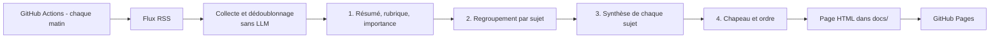

# Architectures envisagées pour la revue de presse par LLM

*Document de conception — octobre 2026. Contexte : agrégation de flux RSS d'actualité
résumée chaque jour par un LLM ; le code et l'infrastructure sont assurés par un responsable technique, les prompts sont définis par un responsable éditorial.*

## Briques communes

Quelle que soit l'architecture : collecte des flux, normalisation et dédoublonnage, traitement par le LLM,
mise en forme, publication, planification. Les options se distinguent par la manière de solliciter le modèle.

## Comparatif

| Architecture | Avantages | Inconvénients | Complexité |
|---|---|---|---|
| **1. Prompt unique** : titres et chapeaux concaténés, un seul appel | Prête en une soirée, peu coûteuse, simple à comprendre | Limites de contexte, doublons mal gérés, omissions et inventions plus probables, qualité irrégulière | Faible |
| **2. Pipeline en étapes** : résumé par article, regroupement par sujet, synthèse par sujet, chapeau | Bonne qualité, sources traçables, vraie gestion des doublons, coût maîtrisé, chaque étape se règle séparément | Plus de code, plus de paramètres à régler | Moyenne |
| **3. Même pipeline orchestré avec n8n** | Workflow visuel, planification et relances intégrées, accessible à un profil peu technique | Auto-hébergement à maintenir, versionnage et tests moins naturels, logique complexe vite illisible | Moyenne (surtout opérationnelle) |
| **4. Agent autonome** : le LLM choisit quoi lire et approfondir | Flexible, peut enrichir un sujet par recherche complémentaire | Non déterministe, plus cher, difficile à déboguer, résultats variables d'un jour à l'autre | Élevée |
| **5. Base vectorielle et RAG** : stockage de l'historique et interrogation | Suivi d'un sujet dans la durée, questions du type « que s'est-il passé cette semaine sur X ? » | Sur-dimensionné pour un résumé quotidien | Élevée |

## Choix retenu : option 2, hébergée sur GitHub

Raisons principales : qualité supérieure au prompt unique, comportement prévisible (contrairement à un agent),
un fichier de prompt par étape (donc des réglages localisés pour le responsable éditorial), et zéro infrastructure à maintenir
grâce à GitHub Actions et GitHub Pages. L'option 1 sert de point de départ pour valider le format ; l'option 3
reste pertinente si un orchestrateur visuel devient un objectif en soi ; les options 4 et 5 ne répondent pas
au besoin d'un résumé quotidien.

## Points de vigilance (valables pour toutes les options)

- **Contenu des flux** : beaucoup de flux ne donnent que titre et chapeau tronqué. Le texte intégral impliquerait
  scraping, paywalls et droit d'auteur ; titre + extrait suffisent souvent et sont plus sûrs juridiquement.
- **Doublons** : un même événement est couvert par de nombreux flux ; sans regroupement, le digest se répète
  ou surpondère les sujets les plus relayés.
- **Hallucinations** : imposer l'usage exclusif du contenu fourni, exiger des sources pour chaque point,
  valider les sorties structurées (JSON).
- **Ligne éditoriale** : le choix des flux et la rédaction des prompts constituent une ligne éditoriale ;
  à documenter et à discuter explicitement.
- **Modèle** : API (meilleure qualité en français, coût de l'ordre de quelques centimes par jour) ou modèle
  local (indépendance, qualité souvent moindre en multilingue). Les données sont publiques : la confidentialité
  n'est pas déterminante.
- **Fiabilité** : flux en erreur, journalisation, archivage de chaque revue produite.

## Organisation du travail

Séparer nettement le code (responsable technique) et l'éditorial (responsable éditorial) : prompts dans des fichiers dédiés, liste de flux
et paramètres dans des fichiers de configuration. Rejouer les étapes LLM sur un **corpus figé** pour comparer
deux versions de prompt à données constantes. Détail dans le `README.md` et `design/carnet-de-bord.md`.

## Évolutions possibles

- Pré-regroupement par embeddings si le volume d'articles devient très grand.
- Flux belges supplémentaires (Le Soir, La Libre, Belga, VRT NWS, The Brussels Times) après vérification des URL.
- Suivi d'un sujet sur plusieurs jours (début de l'option 5) avec l'historique de `data/runs`.
